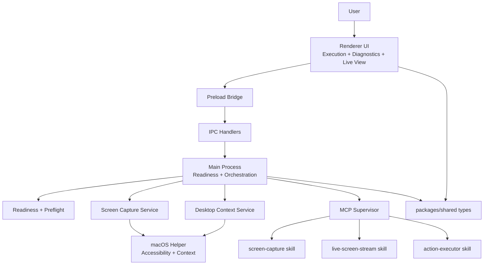

# Big Feature Technical Design: Desktop Control Reliability + Live Vision

## Overview
This document describes the technical design for improving desktop control reliability and adding sampled live vision on macOS. It focuses on readiness preflight, robust tool execution, and live screen sampling without high-FPS streaming.

## Architecture Summary
- Main process orchestrates readiness, IPC, MCP supervision, and tool orchestration.
- Renderer surfaces readiness diagnostics, live view controls, and user guidance.
- MCP skills provide screen capture, live sampling, and action execution.
- Shared types define structured contracts across boundaries.

## Dependency Graph

## Key Flows

### Readiness Preflight
1. On app start or task entry, main process runs readiness checks:
   - Screen recording permission
   - Accessibility permission
   - MCP process health
2. `desktopControl:getStatus` IPC returns `DesktopControlStatus` and remediation copy.
3. Renderer displays diagnostics panel with System Settings path and `Recheck` action.

### Screenshot Capture
1. Renderer requests capture via IPC with `DesktopContextOptions`.
2. Main process uses `screen-capture` skill with bounded retries.
3. Failures return structured `ToolErrorCode` + user-safe message; no generic fallbacks.

### Live Vision Sampling
1. Renderer enables live sampling when flag `liveScreenSampling` is on.
2. Main process starts `live-screen-stream` session with 1 fps default.
3. Renderer polls for newest frame; session expires after 30 seconds (renewable).

### Action Execution
1. Renderer sends structured action intent.
2. Main process validates and clamps input, then calls `action-executor` skill.
3. Responses return structured success/failure with error codes and remediation.

## Contracts and Interfaces
- `DesktopControlStatus`: readiness state + blockers + remediation text.
- `ToolErrorCode`: structured error identifiers for screen/action/live tools.
- `ToolHealthSnapshot`: per-skill health + restart metadata.
- `LiveScreenSession`: session id, ttl, cadence, last frame info.
- `DesktopContextSnapshot`: windows + accessibility + screenshot metadata.

## Failure Handling
- Bounded retries for screenshot capture (max 2) with fallback to full-screen capture.
- MCP supervisor restarts failed skills with exponential backoff.
- Renderer caches the latest readiness state to avoid repeated generic guidance loops.
- Prompt rules require a single, concrete remediation message per failure.

## Risks and Mitigations
- Risk: macOS permission prompts are ignored or revoked.
  - Mitigation: explicit readiness diagnostics + one-click guidance path.
- Risk: MCP skill crash or zombie process blocks tool calls.
  - Mitigation: supervisor health checks + restart backoff + telemetry.
- Risk: Live sampling increases CPU/memory pressure.
  - Mitigation: 1 fps default, 30s TTL, pause when window inactive.
- Risk: Action executor receives unsafe coordinates or shell arguments.
  - Mitigation: input validation, coordinate clamping, safe process execution.
- Risk: Repeated tool failures cause generic fallback loops.
  - Mitigation: structured error codes + prompt rules to name blocker once.
- Risk: UI shows stale readiness state.
  - Mitigation: `Recheck` action + periodic readiness refresh on task entry.

## Open Questions
- Should live sampling pause when screen recorder detects no active desktop session?
- Do we need a per-app opt-in for screen capture beyond global permissions?
- What telemetry sampling rate is safe for live session events at scale?
