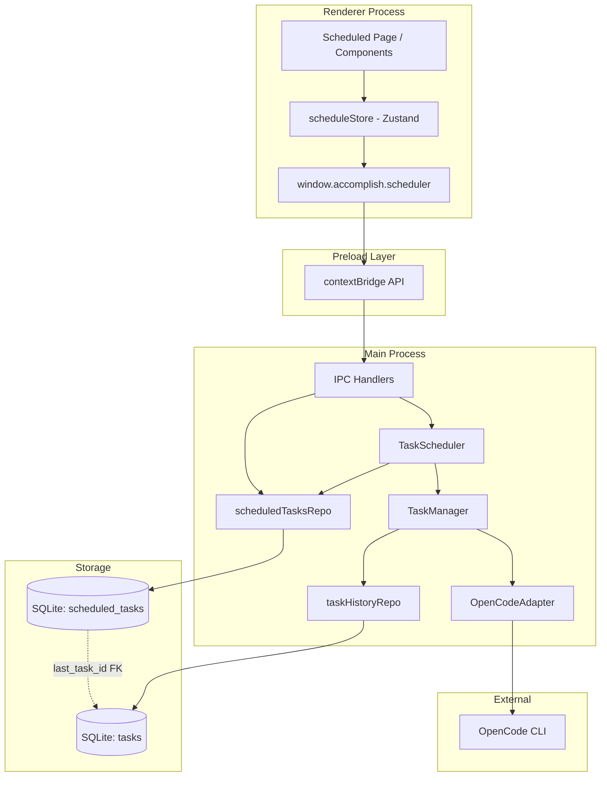
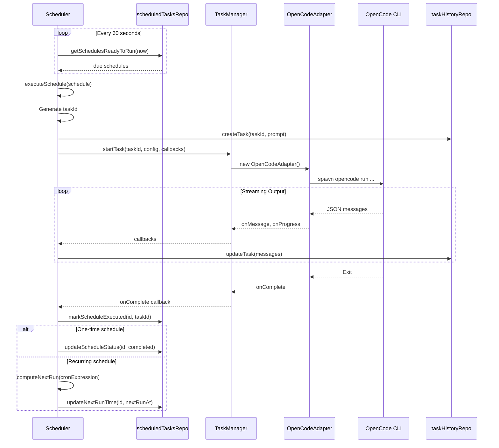
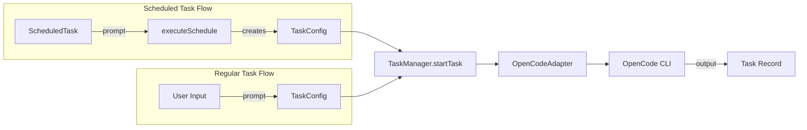
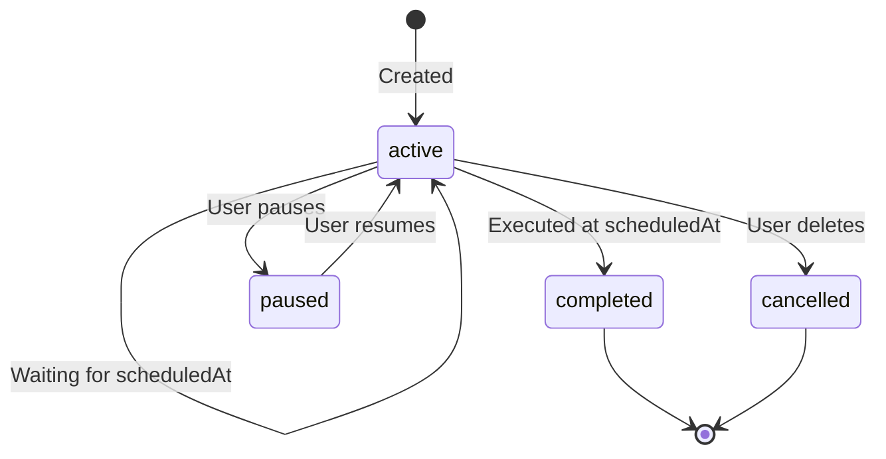
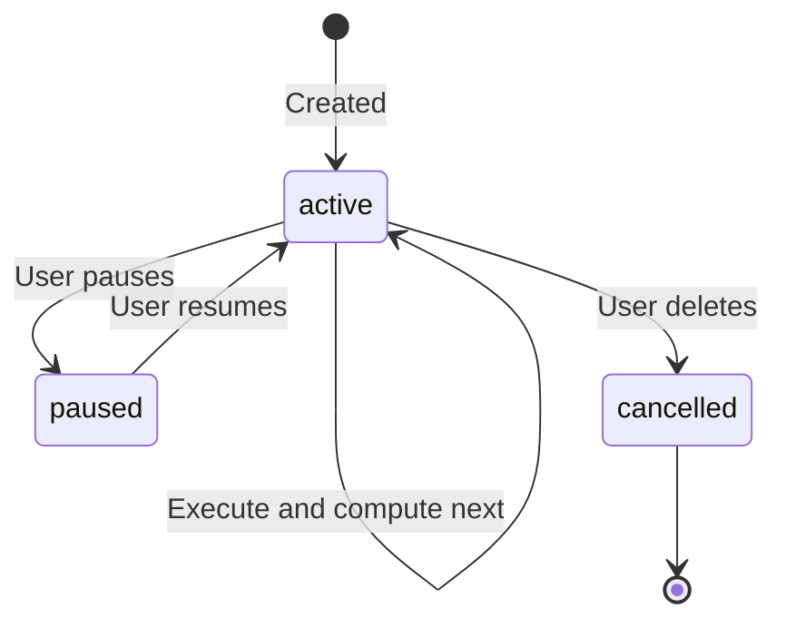
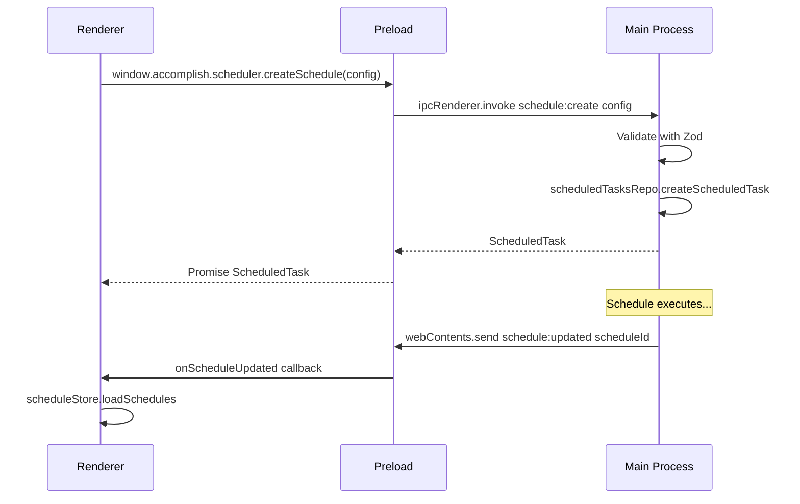

# Scheduled Tasks Architecture

This document describes the complete architecture of the scheduled tasks feature in Accomplish, including how scheduled tasks relate to regular task execution.

## System Overview

The scheduled tasks feature allows users to create tasks that execute automatically at specified times (one-time) or on recurring schedules (cron-based). The system integrates with the existing task execution infrastructure, reusing the OpenCode CLI adapter for actual task execution.



## Architecture Layers

### 1. Renderer Layer (UI)

**Key Files:**

- `apps/desktop/src/renderer/pages/Scheduled.tsx` - Main page
- `apps/desktop/src/renderer/components/schedule/` - UI components
- `apps/desktop/src/renderer/stores/scheduleStore.ts` - Zustand store

**Components:**

| Component | Description |
|-----------|-------------|
| `ScheduleDialog` | Create/edit scheduled tasks |
| `ScheduleCard` | Display individual schedules with status, next run, last task |
| `ScheduleActions` | Run now, pause/resume, edit, delete |
| `OneTimeScheduler` | Date/time picker for one-time schedules |
| `CronBuilder/` | Visual cron expression builder |
| `TemplateGallery` | Pre-built schedule templates |
| `TimezoneSelector` | IANA timezone selection |

**Store Actions:**

- `loadSchedules()` - Fetch all schedules
- `createSchedule(config)` - Create new schedule
- `updateSchedule(id, updates)` - Modify schedule
- `deleteSchedule(id)` - Remove schedule
- `toggleSchedule(id, enabled)` - Pause/resume
- `runScheduleNow(id)` - Immediate execution

### 2. Preload Layer (IPC Bridge)

**File:** `apps/desktop/src/preload/index.ts`

Exposes `window.accomplish.scheduler` API:

```typescript
scheduler: {
  createSchedule(config: CreateScheduleConfig): Promise<ScheduledTask>
  listSchedules(): Promise<ScheduledTask[]>
  getSchedule(id: string): Promise<ScheduledTask | null>
  updateSchedule(id: string, updates: UpdateScheduleConfig): Promise<void>
  deleteSchedule(id: string): Promise<void>
  toggleSchedule(id: string, enabled: boolean): Promise<void>
  runScheduleNow(id: string): Promise<void>
  getActiveCount(): Promise<number>
}
```

**Events:**

- `schedule:updated` - Emitted when schedule changes, triggers store refresh

### 3. Main Process Layer

#### IPC Handlers

**Files:**

- `apps/desktop/src/main/ipc/scheduler/index.ts` - Handler registration
- `apps/desktop/src/main/ipc/scheduler/handlers.ts` - Handler implementations
- `apps/desktop/src/main/ipc/scheduler/validation.ts` - Zod validation schemas

**IPC Channels:**

| Channel | Description |
|---------|-------------|
| `schedule:create` | Create with validation |
| `schedule:list` | Fetch all non-cancelled |
| `schedule:get` | Fetch by ID |
| `schedule:update` | Update with recomputed next run |
| `schedule:delete` | Hard delete |
| `schedule:toggle` | Enable/disable |
| `schedule:run-now` | Trigger immediate execution |
| `schedule:active-count` | Count active schedules |

#### Task Scheduler

**File:** `apps/desktop/src/main/scheduler/index.ts`

**Initialization** (in `apps/desktop/src/main/index.ts`):

```typescript
const scheduler = getScheduler();
scheduler.handleMissedSchedules();
scheduler.start();
```

**Scheduling Mechanism:**

- Interval-based polling every 60 seconds (`CHECK_INTERVAL_MS`)
- Queries for schedules where `next_run_at <= now`
- Uses `cron-parser` for recurring schedule computation
- Supports IANA timezones

**Key Methods:**

| Method | Description |
|--------|-------------|
| `start()` | Begin polling loop |
| `stop()` | Stop polling |
| `checkSchedules()` | Find and execute due schedules |
| `executeSchedule(schedule)` | Execute a single schedule |
| `executeScheduleNow(id)` | Manual trigger |
| `handleMissedSchedules()` | Startup cleanup |

### 4. Data Layer

#### Repository

**File:** `apps/desktop/src/main/store/repositories/scheduledTasks.ts`

**Methods:**

| Method | Description |
|--------|-------------|
| `createScheduledTask(config)` | Generate ID, insert row |
| `getScheduledTask(id)` | Single schedule |
| `getAllScheduledTasks()` | All non-cancelled |
| `getActiveScheduledTasks()` | Active and enabled |
| `getSchedulesReadyToRun(now)` | Due for execution |
| `updateScheduledTask(id, updates)` | Partial update |
| `updateNextRunTime(id, nextRunAt)` | Set next execution |
| `markScheduleExecuted(id, taskId)` | Link to executed task |
| `toggleSchedule(id, enabled)` | Quick enable/disable |
| `deleteScheduledTask(id)` | Hard delete |

#### Database Schema

**File:** `apps/desktop/src/main/store/migrations/v007-scheduled-tasks.ts`

```sql
CREATE TABLE scheduled_tasks (
  id TEXT PRIMARY KEY,              -- sched_{timestamp}_{random}
  prompt TEXT NOT NULL,             -- Task prompt to execute
  schedule_type TEXT NOT NULL,      -- 'one-time' | 'recurring'
  scheduled_at TEXT,                -- ISO timestamp (one-time)
  cron_expression TEXT,             -- 5-field cron (recurring)
  timezone TEXT NOT NULL,           -- IANA timezone
  next_run_at TEXT,                 -- Computed next execution
  last_run_at TEXT,                 -- Last execution time
  last_task_id TEXT REFERENCES tasks(id) ON DELETE SET NULL,
  status TEXT NOT NULL DEFAULT 'active',  -- active|paused|completed|cancelled
  enabled INTEGER NOT NULL DEFAULT 1,
  created_at TEXT NOT NULL,
  updated_at TEXT NOT NULL,
  CHECK (schedule_type IN ('one-time', 'recurring')),
  CHECK (status IN ('active', 'paused', 'completed', 'cancelled')),
  CHECK (
    (schedule_type = 'one-time' AND scheduled_at IS NOT NULL) OR
    (schedule_type = 'recurring' AND cron_expression IS NOT NULL)
  )
)
```

**Indexes:**

- `idx_scheduled_next_run` - Partial index for scheduler queries (active, enabled schedules)
- `idx_scheduled_status` - Status filtering

#### Shared Types

**File:** `packages/shared/src/types/schedule.ts`

```typescript
type ScheduleType = 'one-time' | 'recurring'
type ScheduleStatus = 'active' | 'paused' | 'completed' | 'cancelled'

interface ScheduledTask {
  id: string
  prompt: string
  scheduleType: ScheduleType
  scheduledAt?: string        // One-time only
  cronExpression?: string     // Recurring only
  timezone: string
  nextRunAt?: string
  lastRunAt?: string
  lastTaskId?: string         // FK to tasks table
  status: ScheduleStatus
  enabled: boolean
  createdAt: string
  updatedAt: string
}
```

## Scheduled Task Execution Flow



## Connection: Scheduled Tasks to Regular Tasks

The scheduled tasks system **reuses the existing task execution infrastructure**:



**Key Integration Points:**

1. **Same Execution Path**: Both scheduled and manual tasks use `TaskManager.startTask()`
2. **Same Callbacks**: Progress, messages, permissions, completion - all handled identically
3. **Same Persistence**: Tasks stored in the same `tasks` table
4. **Foreign Key Link**: `scheduled_tasks.last_task_id` references `tasks.id`
5. **Task History**: Scheduled task executions appear in regular task history

**Data Relationship:**

```
scheduled_tasks (1) -----> (*) tasks
                  last_task_id → id
```

One schedule produces many task executions over time. Only the most recent execution is tracked via `last_task_id`.

## Schedule Types

### One-Time Schedule



- `scheduledAt` set to specific ISO timestamp
- `nextRunAt` equals `scheduledAt`
- After execution, status becomes `completed`

### Recurring Schedule



- `cronExpression` defines recurrence (5-field cron)
- `nextRunAt` computed from cron + timezone
- After execution, `nextRunAt` updated to next occurrence
- Never becomes `completed` automatically

## IPC Communication Pattern



## Error Handling

| Error Type | Handling |
|------------|----------|
| Validation Errors | Caught by Zod schemas in IPC handlers, returned as rejected promises |
| Execution Errors | Task marked as `failed`, schedule continues (no automatic retry) |
| Cron Parse Errors | Logged, `nextRunAt` not updated |
| Database Errors | Propagated through IPC with normalized error format |
| Isolation | Error in one schedule doesn't affect others |

## File Structure Summary

```
apps/desktop/src/
├── main/
│   ├── index.ts                    # Scheduler init/dispose
│   ├── scheduler/
│   │   └── index.ts                # TaskScheduler class
│   ├── ipc/
│   │   └── scheduler/
│   │       ├── index.ts            # Handler registration
│   │       ├── handlers.ts         # Handler implementations
│   │       └── validation.ts       # Zod schemas
│   └── store/
│       ├── migrations/
│       │   └── v007-scheduled-tasks.ts
│       └── repositories/
│           └── scheduledTasks.ts
├── preload/
│   └── index.ts                    # scheduler API exposure
└── renderer/
    ├── pages/
    │   └── Scheduled.tsx
    ├── stores/
    │   └── scheduleStore.ts
    └── components/
        └── schedule/
            ├── ScheduleDialog.tsx
            ├── ScheduleCard.tsx
            ├── ScheduleActions.tsx
            ├── OneTimeScheduler.tsx
            ├── ScheduleTypeSelector.tsx
            ├── TemplateGallery.tsx
            ├── TimezoneSelector.tsx
            └── CronBuilder/

packages/shared/src/types/
└── schedule.ts                     # Shared type definitions
```

## Key Design Decisions

1. **Polling vs Event-Driven**: The scheduler uses interval-based polling (60s) rather than precise timers for simplicity and reliability across app restarts.

2. **Reuse Task Infrastructure**: Scheduled tasks create regular tasks via `TaskManager.startTask()` rather than a parallel execution path, ensuring consistency.

3. **Soft vs Hard Delete**: Schedules use hard delete, but the foreign key to tasks uses `ON DELETE SET NULL` to preserve task history.

4. **Dual State Model**: `status` (lifecycle) and `enabled` (toggle) are separate fields, allowing temporary pause without changing lifecycle state.

5. **Timezone Awareness**: All schedules store IANA timezone strings, and cron expressions are evaluated in the specified timezone.

6. **No Automatic Retry**: Failed executions don't retry automatically - this prevents runaway failures and gives users control.
